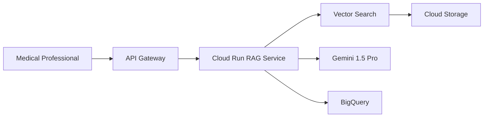

# Multimodal Medical RAG on GCP

A production-ready Retrieval-Augmented Generation (RAG) system for medical imaging and clinical documents, built on Google Cloud Platform.

## Architecture

```
User Query → Embed → Vector Search → Retrieve Context → Gemini → Response
```



**Key Components:**
- **Vertex AI Vector Search** - Semantic similarity matching (ScaNN algorithm)
- **Vertex AI Embeddings** - Text (768-dim) + Multimodal (1408-dim)
- **Gemini 1.5 Pro** - Response generation with medical domain prompts
- **Cloud Storage** - Raw data, processed data, embeddings (Bronze/Silver/Gold layers)
- **BigQuery** - Metadata, document registry, query analytics

## Project Structure

```
multimodal-medical-rag-gcp/
├── src/
│   ├── data_ingestion/       # Data download & synthetic generation
│   ├── embeddings/           # Text & image embedding generation
│   ├── retrieval/            # Vector search client
│   ├── generation/           # RAG pipeline & LLM integration
│   └── utils/                # GCP utilities
├── terraform/
│   ├── environments/         # dev / test / prod configs
│   └── modules/              # Reusable infra modules
├── tests/
│   ├── unit/                 # Unit tests
│   └── integration/          # GCP integration tests
├── data/
│   ├── raw/                  # Original data (gitignored)
│   ├── processed/            # Cleaned data (gitignored)
│   └── embeddings/           # Vector embeddings (gitignored)
├── docs/                     # Architecture diagrams & setup guides
└── notebooks/                # Jupyter notebooks for exploration
```

## Quick Start

### Prerequisites

- Python 3.10+
- Google Cloud SDK (`gcloud`)
- Terraform 1.5+
- GCP Project with billing enabled

### Installation

```bash
# Clone repository
git clone https://github.com/DataNeuron/multimodal-medical-rag-gcp.git
cd multimodal-medical-rag-gcp

# Create virtual environment
python -m venv .venv
source .venv/bin/activate  # Linux/Mac
# .venv\Scripts\activate   # Windows

# Install dependencies
pip install -r requirements.txt

# Configure GCP
cp .env.example .env
# Edit .env with your GCP project details
```

### Generate Synthetic Test Data

```bash
python src/data_ingestion/generate_synthetic_data.py
```

This creates 100 synthetic medical cases:
- 60 pneumonia cases (with infiltrates on X-ray)
- 40 normal cases (clear X-rays)

Output:
- `data/raw/images/` - 512x512 grayscale chest X-rays
- `data/raw/reports/` - Clinical radiology reports
- `data/raw/patient_vitals.csv` - Structured vitals & lab data

### Deploy Infrastructure

```bash
cd terraform/environments/dev
terraform init
terraform plan
terraform apply
```

## Configuration

Key environment variables (`.env`):

| Variable | Description | Default |
|----------|-------------|---------|
| `GCP_PROJECT_ID` | GCP project ID | `multimodal-medical-rag` |
| `GCP_REGION` | Deployment region | `us-central1` |
| `ENVIRONMENT` | Environment name | `dev` |
| `TEXT_EMBEDDING_MODEL` | Text embedding model | `text-embedding-004` |
| `IMAGE_EMBEDDING_MODEL` | Multimodal model | `multimodalembedding@001` |
| `LLM_MODEL` | Generation model | `gemini-1.5-pro` |
| `RAG_TOP_K` | Documents to retrieve | `10` |
| `RAG_SIMILARITY_THRESHOLD` | Min similarity score | `0.7` |

## Usage

### Basic RAG Query

```python
from src.generation import RAGPipeline

# Initialize pipeline
rag = RAGPipeline(
    project_id="your-project",
    location="us-central1"
)

# Query the system
response = rag.query("What are the findings in chest X-rays with pneumonia?")

print(f"Answer: {response.answer}")
print(f"Sources: {response.sources}")
print(f"Confidence: {response.confidence}")
```

### Generate Embeddings

```python
from src.embeddings import TextEmbedder, ImageEmbedder

# Text embeddings (768 dimensions)
text_embedder = TextEmbedder()
embedding = text_embedder.embed("Bilateral infiltrates in lower lobes")

# Image embeddings (1408 dimensions)
image_embedder = ImageEmbedder()
embedding = image_embedder.embed("path/to/xray.jpg")
```

## Testing

```bash
# Run all tests
pytest tests/

# Unit tests only
pytest tests/unit/

# Integration tests (requires GCP credentials)
pytest tests/integration/

# With coverage
pytest --cov=src tests/
```

## Data Pipeline

```
Bronze Layer (Raw)     →  Silver Layer (Processed)  →  Gold Layer (Embeddings)
├── DICOM images           ├── Normalized images         ├── Image vectors (1408-dim)
├── Clinical reports       ├── Extracted text            ├── Text vectors (768-dim)
└── Structured data        └── Validated metadata        └── Vector Search index
```

## GCP Services Used

| Service | Purpose |
|---------|---------|
| Vertex AI | Embeddings, LLM (Gemini), Vector Search |
| Cloud Storage | Data lake (Bronze/Silver/Gold buckets) |
| BigQuery | Metadata, analytics, hybrid search filters |
| Cloud Run | API hosting (future) |
| Cloud Functions | Event-driven processing (future) |
| Cloud Build | CI/CD pipeline |

## Contributing

1. Fork the repository
2. Create a feature branch (`git checkout -b feature/amazing-feature`)
3. Commit changes (`git commit -m 'Add amazing feature'`)
4. Push to branch (`git push origin feature/amazing-feature`)
5. Open a Pull Request

## License

This project is for educational and research purposes.

## Disclaimer

**This system uses SYNTHETIC data and should NOT be used for clinical decisions.**

The synthetic medical data is generated for testing purposes only and does not represent real patient information.
